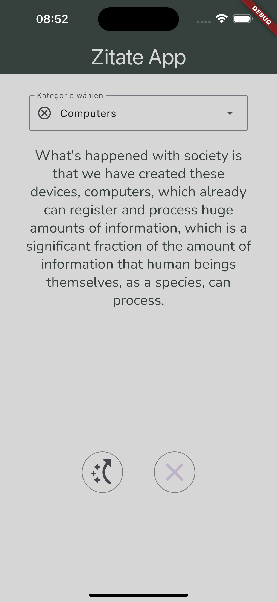

# zitate_app

## Eine kleine App die Zitate anzeigt und das Zitat über einen Neustart der App hinweg speichert.

Aufgabe war:

 - API Abfragen zu verstehen und zu nutzen
 - Shared Preferences zu nutzen und das darüber Wissen zu festigen
 

 ## Als Bonusaufgabe

 Das Dropdownmenü, über das man Kategorien wählen kann, die ebenfalls in den Shared Preferences gespeichert werden.